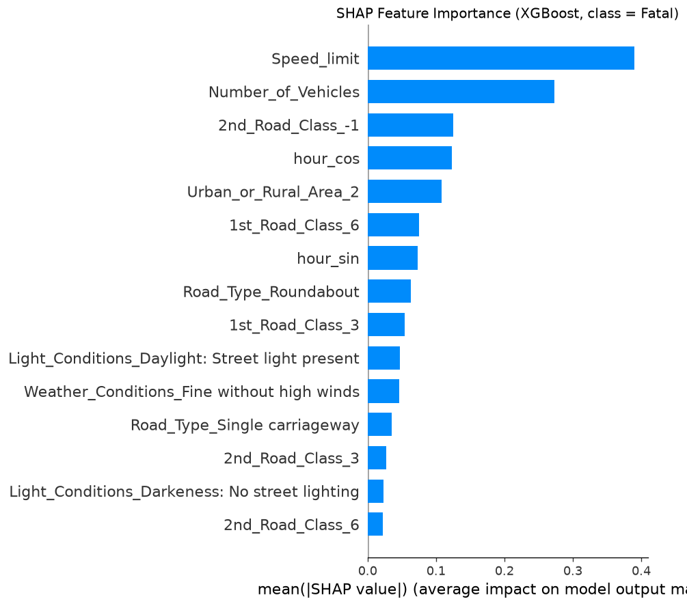

# UK Road Accident Severity — Prediction & Analysis

Predicting UK road accident severity (Fatal / Serious / Slight) from ~1.5M
Department for Transport records (2005–2018), using only features available
*before* the accident occurred: road, vehicle, weather, light, time, and
location descriptors. Compares Logistic Regression, Random Forest, and
XGBoost baselines.

Originally built as a class project for **Penn CIS 545** (Big Data Analytics)
by Garret Fantini, Stanley Jin, and Yuliya Solyanyk — [class walk-through
video](https://www.youtube.com/watch?v=lpXY0dqei-o). This repo is my port to
a reproducible, locally runnable project with a Streamlit demo.

## Results

Test-set metrics after downsampling Slight/Serious to 60k rows each (Fatal
kept at ~15.5k). Macro F1 is the headline metric — it weights all three
classes equally, unlike accuracy which is inflated by the dominant Slight
class.

<!-- BEGIN RESULTS TABLE -->
| Model | Macro F1 | Accuracy | F1 Fatal | F1 Serious | F1 Slight |
| --- | --- | --- | --- | --- | --- |
| Logistic Regression | 0.346 | 0.586 | 0.043 | 0.282 | 0.714 |
| Random Forest | 0.336 | 0.539 | 0.072 | 0.240 | 0.696 |
| XGBoost | **0.364** | **0.606** | 0.066 | 0.292 | **0.733** |

Classes: 0 = Fatal, 1 = Serious, 2 = Slight. XGBoost wins overall, but F1 on
Fatal is dismal across the board — that's the story below in *What I'd do next*.
<!-- END RESULTS TABLE -->

Detailed JSON with per-class precision/recall/F1, confusion matrices, and
selected hyperparameters is in `reports/baseline_results.json`.

### Feature importance (XGBoost, Fatal class)



Speed limit and number of vehicles dominate the model's fatal-class
predictions. Time-of-day (cyclical hour) and urban/rural setting are
secondary contributors. See the notebook for the full narrative.

## Quickstart

```bash
# 1. Install dependencies (creates .venv, installs from uv.lock)
uv sync

# 2. Get the dataset (~450 MB) — Kaggle API if set up, else prints manual instructions
make data

# 3. Run the pipeline: prepare → train → figures  (5–15 min on a laptop)
make all

# 4. Interactive demo
make app
```

macOS note: XGBoost needs OpenMP — `brew install libomp`.

## Layout

```
src/road_accidents/   # reusable, model-agnostic functions (data, features, encoding, viz, evaluate, training)
baseline/             # the original 3 class-project models (fixed reference point)
experiments/          # new models — see "Adding a new experiment" below
scripts/              # thin ordered pipeline (download, prepare, train_baseline, train_experiment, make_figures)
app.py                # Streamlit demo — pick conditions, see predicted probabilities
notebooks/            # narrative walk-through (imports from src/)
tests/                # pytest suite for features + encoding
data/                 # raw/ (gitignored, 450 MB) and processed/ parquet artifacts
models/               # fitted encoders + baseline/ and experiments/ joblib files (small ones committed)
reports/figures/      # PNGs referenced above
```

### Adding a new experiment

Copy `experiments/_template.py` to `experiments/<your_module>.py`, fill in
`NAME`, `SLUG`, and `train()`, then run:

```bash
make experiment NAME=<your_module>
```

This trains on the same preprocessed data and test split as baseline, saves
the model to `models/experiments/<SLUG>.joblib`, and upserts the result into
`reports/experiments_results.json` — it never touches
`reports/baseline_results.json`.

## What I'd do next

The class-project results are honestly weak on the rarest class (fatal
accidents), even after RandomUnderSampler downsampling. The imbalance ratio
is roughly 60:1 Slight-vs-Fatal in the raw data. Things I'd try if this were
a real project rather than a class exercise:

- **Threshold tuning** on predicted probabilities per class rather than
  taking argmax — the Fatal probabilities cluster near zero even for true
  Fatal accidents, so a fixed threshold below 0.5 could recover recall.
- **Class-weighted loss** for XGBoost via `sample_weight`, not just for RF
  where `class_weight='balanced'` is already in the grid.
- **SMOTE / SMOTE-NC** to synthesize minority-class examples instead of
  discarding majority-class information.
- **Calibration** via `CalibratedClassifierCV` (Platt or isotonic) so the
  Streamlit demo's probabilities are actually interpretable as
  probabilities.
- **Richer features**: casualty age / vehicle type / driver info from the
  companion Vehicles table (excluded here because it's post-crash for the
  same accident but includes some pre-crash characteristics).

## Credits

Original class team: Garret Fantini, Stanley Jin, Yuliya Solyanyk (Penn CIS 545, 2024). Refactor and Streamlit demo by Garret Fantini.

Data: UK Department for Transport Road Safety Data, via
[Kaggle](https://www.kaggle.com/datasets/silicon99/dft-accident-data).
