# UK road-accident severity modeling report

Garret Fantini<br>
August 27, 2026<br>
Extension of a course project for UPenn CIS 545: Big Data Analytics

## Executive summary

I investigated how well road, time, weather, and lighting conditions available before a reported collision can distinguish Fatal, Serious, and Slight outcomes. The source file contains 1,504,150 UK Department for Transport collision records from nine represented years—2005–2007 and 2009–2014. After removing 150 records with missing retained values, the analytical cohort contains 1,504,000 collisions. Fatal outcomes account for only 1.29%, making accuracy a poor standalone measure of performance.

This portfolio extension also corrects a leakage problem in the original course project. The earlier feature set included `Number_of_Vehicles`, which is known only after a collision. I defined a prediction-time feature contract, removed post-collision fields, discarded incompatible model artifacts and claims, and retrained every reported strategy using fold-local preprocessing and training-only model selection.

No model was uniformly strongest. The downsampled baseline achieved the highest default held-out macro F1 (0.344), while the jointly tuned model achieved the highest accuracy (0.775) and Fatal F1 (0.086) at the cost of a Serious F1 of only 0.041. The interpolated-weight model offered a more balanced high-recall operating profile, recovering 55.2% of Fatal cases at default prediction, but its Fatal precision was only 3.8%. These results are not adequate for an automated severity decision system. They instead show how class weighting and threshold selection expose tradeoffs that could inform a carefully governed screening workflow when missed Fatal cases are more costly than false alerts.

## Problem definition and scope

Each row represents a police-reported personal-injury collision labeled Fatal, Serious, or Slight. The task is three-class classification conditional on a collision having occurred. It is not a model of whether a collision will happen, because the dataset contains no exposure observations for journeys without collisions.

Only information intended to be available before the collision is admitted to the model. This includes road type and class, speed limit, pedestrian-crossing facilities, day and time, urban or rural context, season, lighting, weather, and road-surface conditions. Geographic coordinates and administrative identifiers are not model inputs. Some contemporaneous conditions may also be unavailable at the earliest operational decision point, so the prediction-time premise would need to be checked for any proposed use.

The outputs are classification scores, not calibrated probabilities of fatality or crash risk. Downsampling and class weighting deliberately alter the effective training distribution, and no Platt, isotonic, or other calibration procedure was performed.

## Data and exploratory analysis

The raw CSV contains 1,504,150 rows and 33 columns. There are no exact duplicate rows, although 576,763 rows repeat a previously observed `Accident_Index`; the repository does not document why identifiers recur across the combined source file. Because those rows differ in other fields and the identifier is excluded, I do not treat them as exact duplicates. Only `Time` (117 rows) and `Pedestrian_Crossing-Physical_Facilities` (34 rows) are missing among retained fields; their overlap leaves 150 rows with at least one missing retained value. Complete-case cleaning therefore removes 0.01% of the source rows and leaves 1,504,000 observations. The audit found no invalid severity, weekday, road-class, speed-limit, urban/rural, date, time, or blank retained-string values.

The represented years are 2005, 2006, 2007, 2009, 2010, 2011, 2012, 2013, and 2014. The absence of 2008 and all years after 2014 means that the file should not be described as a continuous 2005–2018 panel, despite the broader range previously stated in the repository README.

### Recorded accidents by severity

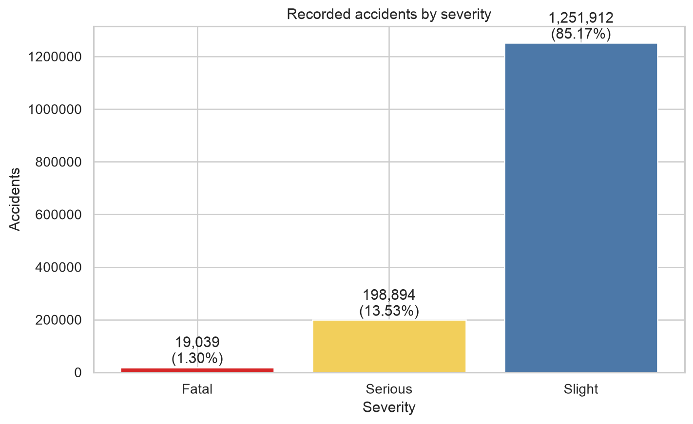

The cleaned data contains 19,439 Fatal collisions (1.29%), 204,478 Serious collisions (13.60%), and 1,280,083 Slight collisions (85.11%). A classifier that favored the dominant class could therefore achieve high accuracy while offering little value on Fatal or Serious cases. This imbalance motivates macro F1 and per-class metrics.

### Temporal distribution of recorded accidents

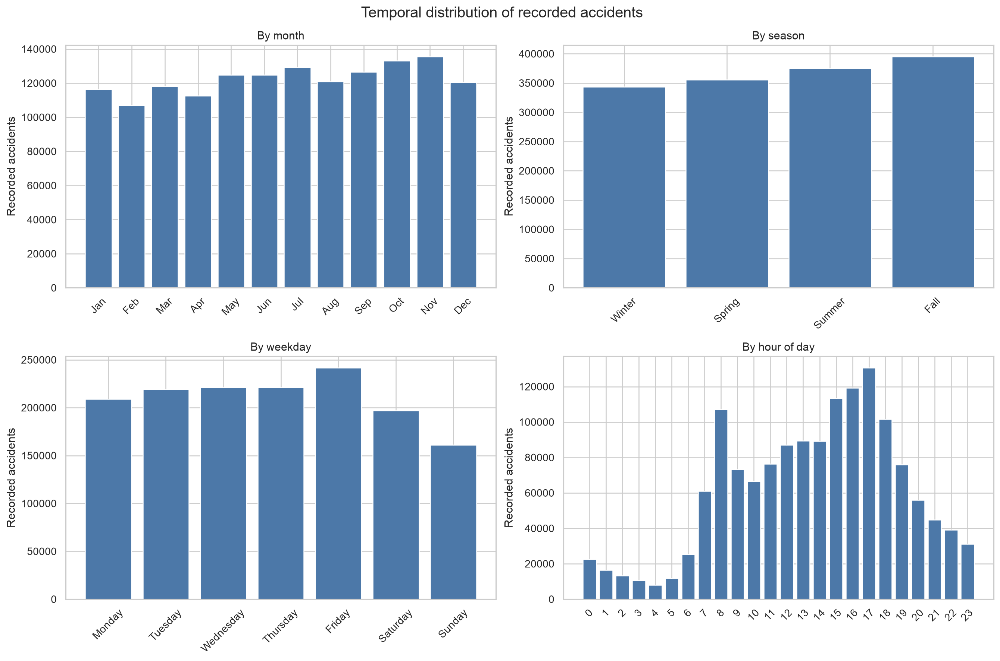

Recorded collisions are most common in the late afternoon, with a visible peak around 17:00, and Friday has the largest weekday count (247,120). November is the highest-volume month (138,544), while autumn has the largest seasonal total. These are collision counts rather than exposure-normalized rates: differences in traffic volume could explain part of each pattern.

### Road context and severity composition

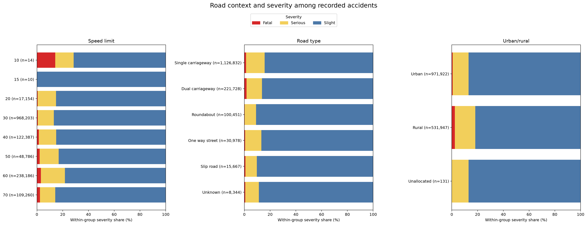

Most recorded collisions occur at 30 mph limits (968,203; 64.4%) and on single carriageways (1,126,832; 74.9%). Rural collisions have a larger Fatal share than urban collisions (2.35% versus 0.71%), and the Fatal share is highest among well-populated speed-limit groups at 60 mph (3.14%). Collisions recorded in darkness with no street lighting also have a larger Fatal share (4.36%) than daylight collisions. These are within-collision severity proportions, not causal estimates or evidence that a setting creates more collisions per journey.

## Feature contract and leakage audit

The original analysis used `Number_of_Vehicles`, which describes the collision after it occurred. It could improve apparent prediction while violating the intended pre-collision use case. I removed it together with `Number_of_Casualties` and police-attendance status, then invalidated and retrained the earlier models rather than carrying forward contaminated results.

The final model contract retains road type; first and second road class; speed limit; physical pedestrian-crossing facilities; day of week; urban/rural context; lighting; weather; and road-surface conditions. Date and time are transformed before fitting: month maps to one of four seasons, hour maps to sine and cosine components to preserve its cyclical structure, and hours 7–9 and 16–18 produce a rush-hour indicator. Categorical inputs and season are one-hot encoded, while speed limit and the engineered time fields pass through unchanged. Every transformation is fitted inside the model pipeline.

Row identifiers, coordinates, road numbers, local-authority fields, police-force codes, and LSOA identifiers are excluded as identifiers or high-cardinality geographic fields. The repository does not preserve a narrower rationale for excluding `Year`, `Junction_Control`, `Pedestrian_Crossing-Human_Control`, `Special_Conditions_at_Site`, or `Carriageway_Hazards`; it records only that they are outside the current analytical feature contract. The latter two are also 97.6% and 98.2% missing, respectively. This undocumented design history is a limitation rather than a basis for inventing a retrospective justification.

## Experimental design

I created one deterministic stratified 80/20 split with random seed 42: 1,203,200 training rows and 300,800 untouched test rows. The test set contains 3,888 Fatal, 40,895 Serious, and 256,017 Slight collisions. All preprocessing, resampling, weighting, hyperparameter selection, and threshold selection occur on training data. Cross-validation fits a fresh preprocessing-and-model pipeline within each fold, preventing validation observations from influencing learned category encodings or resampling.

Hyperparameter and weight searches use training-fold macro F1. Selected configurations receive fresh validation where specified and are then fitted to the complete training split. The evaluation script is the only stage that compares every frozen model on the held-out test set. Fatal thresholds are selected from five-fold out-of-fold training probabilities; test labels do not determine the threshold.

Macro F1 is the primary summary metric because it gives equal weight to Fatal, Serious, and Slight F1 scores. Fatal precision measures how many Fatal predictions are correct, Fatal recall measures how many actual Fatal cases are retrieved, and Fatal F1 balances those quantities. Per-class F1 exposes performance hidden by an aggregate. Accuracy remains useful descriptively but is secondary because Slight cases dominate the data.

## Modeling approaches

### Downsampled XGBoost baseline

The reference strategy keeps all Fatal training rows while capping Serious and Slight observations at 60,000 each within the resampling pipeline. This reduces majority-class dominance by discarding observations. Its fixed XGBoost configuration uses 200 trees, depth 7, and learning rate 0.07.

### Fixed class-weighted XGBoost

The fixed weighted model retains every training observation and assigns balanced sample weights inversely related to class frequency. It tests whether weighting can improve minority retrieval without throwing away most Slight collisions. Its fixed configuration uses 200 trees, depth 6, and learning rate 0.05.

### Tuned class-weighted XGBoost

This strategy keeps fully balanced sample weights but samples 12 hyperparameter candidates deterministically. Three-fold training CV selects the candidate with the highest mean macro F1, followed by fresh five-fold validation. The winner uses 600 trees, depth 7, learning rate 0.07, subsample 0.7, column subsample 0.6, minimum child weight 5, gamma 0.1, and L2 regularization 5.

### Interpolated class-weight XGBoost

Full inverse-frequency weighting may overcorrect, so this model interpolates between unit and balanced sample weights using `1 + alpha × (balanced_weight − 1)`. A coarse three-fold search over alpha from 0 to 1 is followed by a fine search around the winner. With the tuned XGBoost parameters fixed, alpha 0.90 achieves the strongest training-fold macro F1 (0.3424) and is fitted to the full training split.

### Joint hyperparameter-and-class-weight tuned XGBoost

The joint experiment samples 20 combinations of alpha and XGBoost parameters with seed 42, selects by three-fold mean macro F1, and validates the frozen winner with five fresh folds. Candidate 6 wins with alpha 0.610, 1,000 trees, depth 6, and learning rate 0.125. Joint tuning seeks a better interaction between model capacity and minority weighting than the sequential searches provide.

### Cumulative-binary ordinal XGBoost

The ordinal formulation uses two balanced binary models with the tuned XGBoost parameters: one estimates Serious-or-worse and the other estimates Fatal. Their outputs are reconciled to preserve cumulative ordering and converted into Fatal, Serious, and Slight probabilities. This approach encodes the natural severity order, but separate binary objectives do not guarantee better three-class discrimination.

## Results and model tradeoffs

### Held-out model comparison

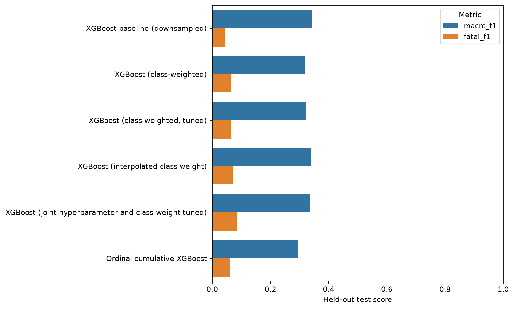

### Compact held-out metrics

| Model | Accuracy | Macro F1 | Fatal precision | Fatal recall | Fatal F1 | Serious F1 | Slight F1 |
| --- | ---: | ---: | ---: | ---: | ---: | ---: | ---: |
| Downsampled baseline | 0.582 | **0.344** | 0.083 | 0.041 | 0.055 | **0.262** | 0.714 |
| Fixed class-weighted | 0.540 | 0.319 | 0.033 | 0.630 | 0.063 | 0.185 | 0.708 |
| Tuned class-weighted | 0.546 | 0.324 | 0.035 | 0.578 | 0.066 | 0.197 | 0.710 |
| Interpolated class weight | 0.653 | 0.340 | 0.038 | 0.552 | 0.070 | 0.146 | 0.803 |
| Joint hyperparameter and weight tuned | **0.775** | 0.337 | 0.049 | 0.380 | **0.086** | 0.041 | **0.884** |
| Cumulative-binary ordinal | 0.652 | 0.297 | 0.032 | **0.642** | 0.061 | 0.018 | 0.812 |

The downsampled baseline has the highest default test macro F1 at 0.344 and the highest Serious F1 at 0.262, but its Fatal recall is only 4.1%. The jointly tuned model has the highest accuracy (0.775), Fatal F1 (0.086), and Slight F1 (0.884). Its accuracy comes largely from retrieving Slight cases while identifying only 2.25% of Serious cases, producing a Serious F1 of 0.041. It is therefore not a universal winner.

The interpolated-weight model is a more balanced high-recall option: it reaches 55.2% Fatal recall, 0.340 macro F1, and 0.653 accuracy. Fixed class weighting retrieves 63.0% of Fatal cases, and the ordinal model retrieves 64.2%, but their Fatal precision is approximately 3%. The ordinal model also identifies less than 1% of Serious cases. In practical terms, higher Fatal recall is obtained by labeling many non-Fatal collisions as Fatal.

The differences among objectives are substantive: choosing by accuracy favors Slight performance, choosing by macro F1 favors the downsampled baseline, and choosing by Fatal recall favors the ordinal or fixed-weighted strategies. None combines strong precision and recall across all three classes, so deployment would require an explicit error-cost policy rather than a generic claim that one model is “best.”

## Threshold analysis and error analysis

Threshold analysis uses the downsampled baseline because it is the default macro-F1 reference. Its ordinary argmax predictions identify 158 of 3,888 Fatal test cases, for 4.1% recall and 8.3% precision. The normalized confusion matrix also shows 53.6% Serious recall and 59.8% Slight recall, illustrating that even the macro-F1 leader separates the classes weakly.

### Fatal precision–recall curve — downsampled baseline

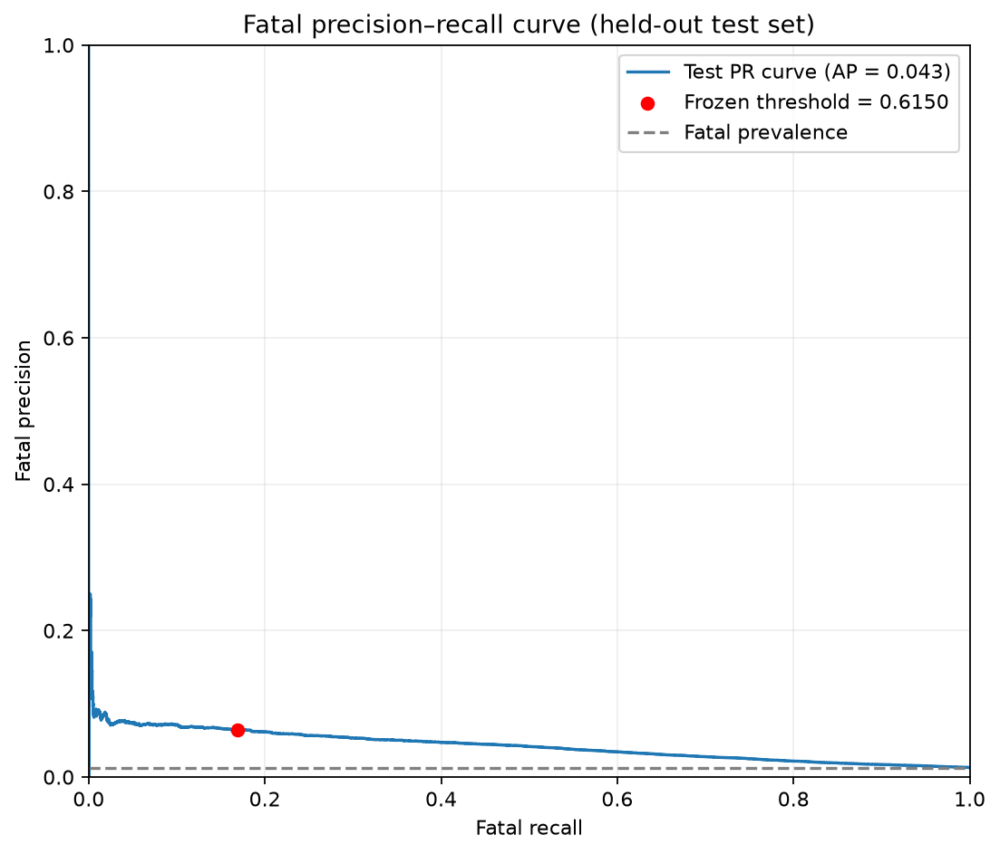

The Fatal average precision is 0.045. The threshold of 0.27 was selected by macro F1 using five-fold out-of-fold training predictions, not the test set. Applied to held-out Fatal scores, it raises Fatal recall to 23.9% while precision falls to 6.1%.

### Fatal threshold tradeoff — downsampled baseline

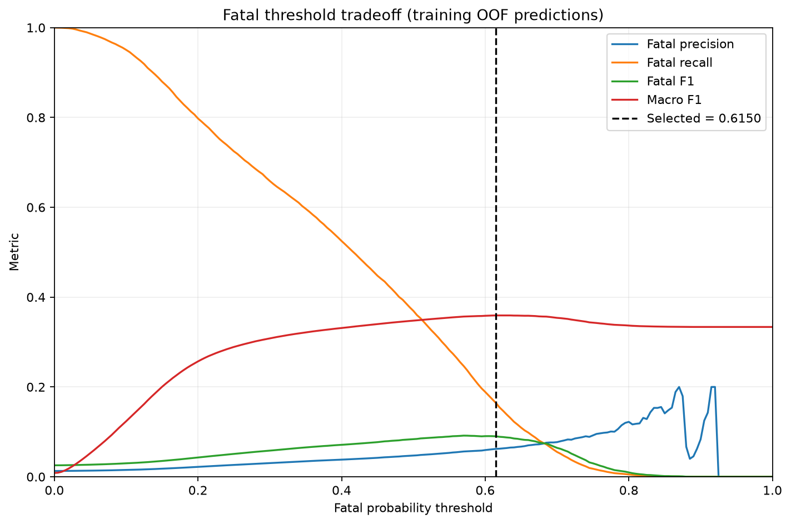

At 0.27, 15,303 of 300,800 test observations (5.09%) trigger a Fatal alert. Of these, 929 are actual Fatal cases and 14,374 are false alerts; 2,959 Fatal cases remain missed. Thus, approximately 94% of alerts are false positives even though roughly three quarters of Fatal cases are still not retrieved. The threshold changes the operating point—it does not create new discriminatory information or make the scores calibrated.

### Normalized confusion matrix — downsampled baseline

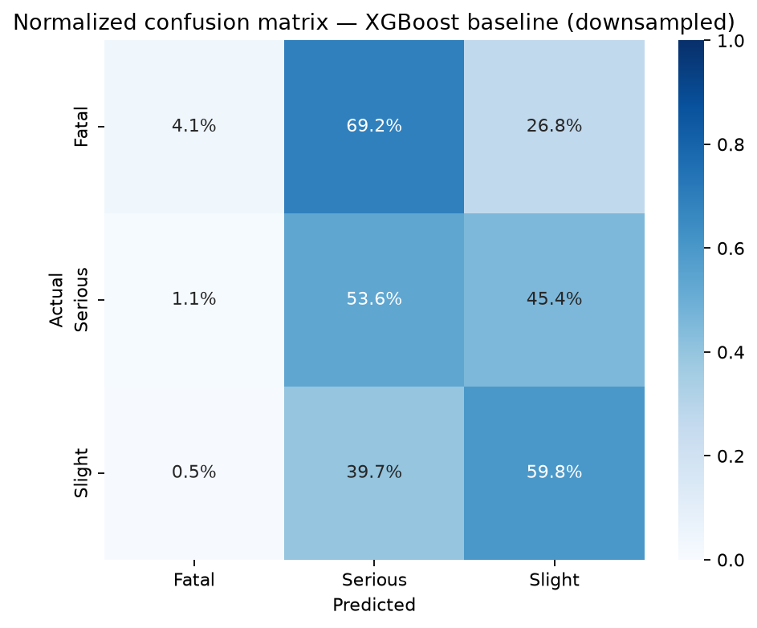

The operational acceptability of this tradeoff cannot be decided from model metrics alone. A screening application would need a defined intervention, alert-handling capacity, costs for false alarms and missed cases, and validation that all required conditions are available at decision time.

## Interpretability and class overlap

### Fatal-specific SHAP effects — downsampled baseline

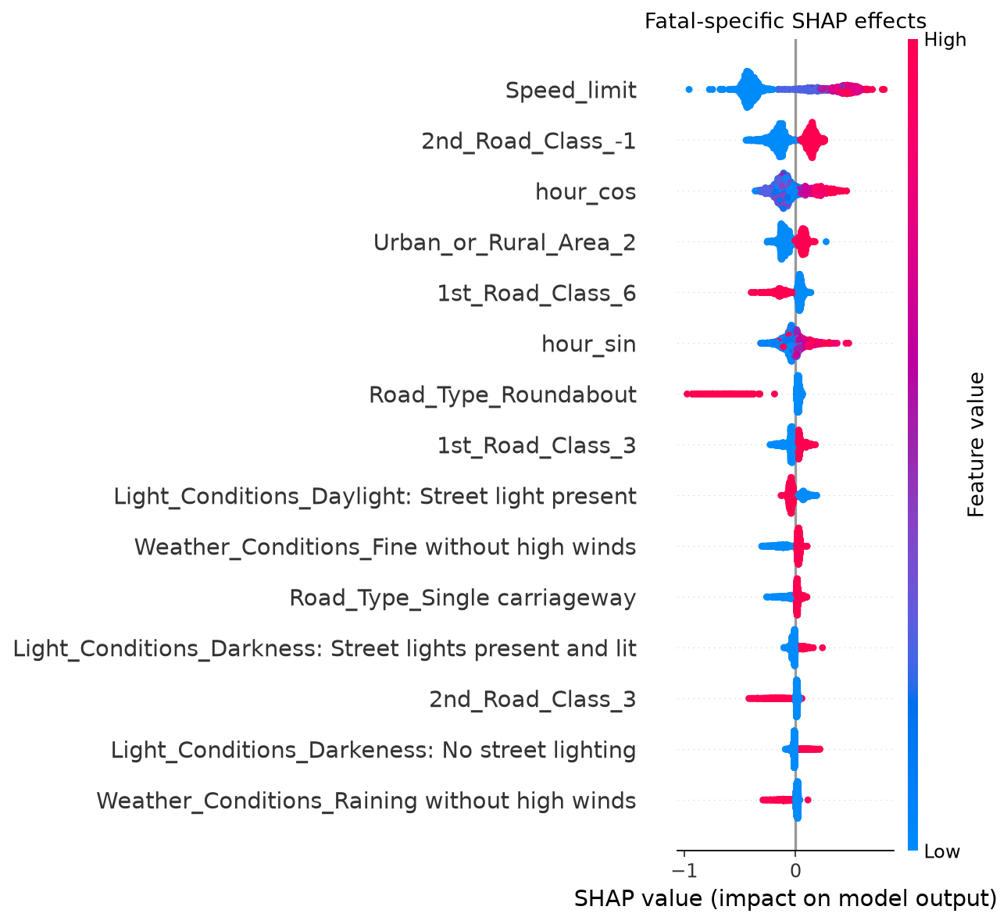

TreeSHAP values were computed for a deterministic sample of 2,000 held-out rows. After aggregating one-hot components back to their source fields, speed limit has the largest mean absolute Fatal SHAP value (0.388), followed by hour of day (0.211), second road class (0.210), first road class (0.136), and road type (0.117). These values rank influence on this fitted model; they do not establish causal effects of changing a road or environmental condition.

### Speed-limit overlap by true severity

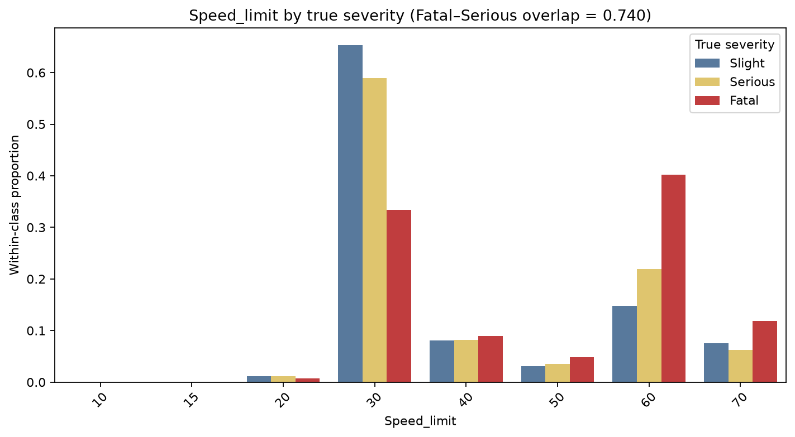

The strongest model feature still overlaps substantially across true classes. Speed-limit distributions have probability-mass overlap of 0.736 between Fatal and Serious cases and 0.670 between Fatal and Slight cases. Hour-of-day overlap is still greater—0.893 for Fatal versus Serious—and road type overlap is 0.944. These shared distributions help explain why reweighting changes prediction frequency more readily than it produces clean class separation.

## Limitations, ethics, and appropriate use

The dataset includes police-reported personal-injury collisions only. It omits uneventful journeys and therefore cannot support exposure-adjusted claims about where or when collisions are more likely. Reporting and coding practices may vary, and the nine represented years are historical and non-contiguous. There is no external or time-based validation to test geographic transfer or temporal drift.

The retained features are limited to the current contract, whose rationale is incomplete for several exclusions. Geographic coordinates are not modeled, and contemporaneous weather, lighting, surface, or location-context inputs may not be known in every early-response setting. The scores are uncalibrated, and the project does not establish that a threshold transfers to a new period or agency.

False negatives could withhold attention from genuinely Fatal collisions; false positives could overwhelm responders, delay other work, or create inequitable resource allocation if model errors vary across places or populations. Given the low precision and incomplete validation, the models should not autonomously determine severity or allocate emergency services. At most, they provide evidence for designing a prospective, human-supervised screening study with monitoring and an explicit cost function.

## Conclusion and next steps

Pre-collision road and environmental conditions contain some signal about recorded collision severity, but the six XGBoost strategies do not separate Fatal, Serious, and Slight outcomes reliably enough for automated decisions. The strongest default macro F1 is 0.344, and every attempt to retrieve more Fatal cases produces substantial false-positive costs or loses performance on Serious cases. The main result is therefore a tradeoff map, not a deployable winner.

The next steps should be time-based validation on newer data, external validation across jurisdictions, and probability calibration performed strictly within training folds. Additional pre-collision exposure features—such as traffic volume or journey-level denominators—would be needed to address risk rather than severity conditional on a collision. Any operational evaluation should define the intervention, capacity constraints, and relative costs of missed Fatal cases, false Fatal alerts, and confusion between Serious and Slight outcomes before selecting a model or threshold.

# Appendices

## Appendix A — Reproducibility commands

Python 3.11 and the raw `UK_Accident.csv` file under `data/raw/` are required.

```bash
make setup
make data
make eda
make train-baseline
make train-weighted
make train-tuned
make train-interpolated
make train-ordinal
make train-joint
make evaluate
make error-analysis
make test
```

The joint search is intentionally separate from `make train-all`; it must finish before the held-out comparison is regenerated with `make evaluate`.

## Appendix B — Complete feature contract

### Model inputs

| Group | Features | Transformation |
| --- | --- | --- |
| Road context | `Road_Type`, `1st_Road_Class`, `2nd_Road_Class`, `Urban_or_Rural_Area` | One-hot encoded |
| Conditions | `Light_Conditions`, `Weather_Conditions`, `Road_Surface_Conditions` | One-hot encoded |
| Crossing context | `Pedestrian_Crossing-Physical_Facilities` | One-hot encoded |
| Calendar | `Day_of_Week`, engineered `Season` | One-hot encoded |
| Numeric | `Speed_limit`, `hour_sin`, `hour_cos`, `rush_hour` | Passed through |

`Date` supplies month and season, while `Time` supplies hour, cyclical components, and rush-hour status. Raw `Date`, `Time`, and intermediate `Month` are not passed to XGBoost.

### Excluded source fields

| Rationale | Fields |
| --- | --- |
| Post-collision leakage | `Number_of_Vehicles`, `Number_of_Casualties`, `Did_Police_Officer_Attend_Scene_of_Accident` |
| Row or collision identifiers | `Unnamed: 0`, `Accident_Index` |
| Geographic coordinates | `Location_Easting_OSGR`, `Location_Northing_OSGR`, `Longitude`, `Latitude` |
| High-cardinality geographic or administrative identifiers | `Police_Force`, `Local_Authority_(District)`, `Local_Authority_(Highway)`, `1st_Road_Number`, `2nd_Road_Number`, `LSOA_of_Accident_Location` |
| Outside current contract; narrower rationale not documented | `Year`, `Junction_Control`, `Pedestrian_Crossing-Human_Control`, `Special_Conditions_at_Site`, `Carriageway_Hazards` |

## Appendix C — Hyperparameters and tuning candidates

### Fixed and selected configurations

| Model | Trees | Depth | Learning rate | Subsample | Column sample | Minimum child weight | Gamma | L1 | L2 | Weighting |
| --- | ---: | ---: | ---: | ---: | ---: | ---: | ---: | ---: | ---: | --- |
| Downsampled baseline | 200 | 7 | 0.070 | 1.000 | 1.000 | 1 | — | — | — | Retain all Fatal; cap Serious/Slight at 60,000 each |
| Fixed class-weighted | 200 | 6 | 0.050 | 0.700 | 0.800 | 5 | — | — | — | Balanced sample weights |
| Tuned class-weighted | 600 | 7 | 0.070 | 0.700 | 0.600 | 5 | 0.1 | 0 | 5 | Balanced sample weights |
| Interpolated weights | 600 | 7 | 0.070 | 0.700 | 0.600 | 5 | 0.1 | 0 | 5 | Alpha 0.900 |
| Joint tuned | 1,000 | 6 | 0.125 | 0.832 | 0.942 | 3 | 0.5 | 0.282 | 0.522 | Alpha 0.610 |
| Ordinal cumulative | 600 | 7 | 0.070 | 0.700 | 0.600 | 5 | 0.1 | 0 | 5 | Balanced binary sample weights |

### Tuned class-weighted search

All candidates use 600 trees and balanced weights. Complete precision is retained in [the JSON results](results/xgb_tuning_results.json).

| Candidate | Depth | Rate | Child weight | Subsample | Column sample | Gamma | L1 | L2 | CV macro F1 |
| ---: | ---: | ---: | ---: | ---: | ---: | ---: | ---: | ---: | ---: |
| 1 | 4 | 0.05 | 3 | 0.8 | 0.9 | 0.05 | 0.0 | 5 | 0.3175 |
| 2 | 5 | 0.09 | 5 | 0.9 | 0.8 | 0.00 | 0.5 | 5 | 0.3211 |
| 3 | 5 | 0.05 | 8 | 0.6 | 0.6 | 0.00 | 0.5 | 20 | 0.3200 |
| 4 | 5 | 0.05 | 3 | 0.8 | 0.6 | 0.10 | 0.5 | 5 | 0.3198 |
| 5 | 5 | 0.05 | 8 | 0.9 | 0.9 | 0.00 | 0.0 | 20 | 0.3198 |
| 6 | 7 | 0.03 | 1 | 0.6 | 0.7 | 0.10 | 0.1 | 5 | 0.3239 |
| 7 | 6 | 0.09 | 3 | 0.6 | 0.7 | 0.05 | 0.1 | 10 | 0.3229 |
| 8 | 5 | 0.07 | 5 | 0.8 | 0.9 | 0.00 | 0.1 | 5 | 0.3210 |
| **9** | **7** | **0.07** | **5** | **0.7** | **0.6** | **0.10** | **0.0** | **5** | **0.3254** |
| 10 | 5 | 0.05 | 1 | 0.8 | 0.8 | 0.05 | 0.0 | 5 | 0.3201 |
| 11 | 6 | 0.09 | 5 | 0.8 | 0.6 | 0.05 | 0.5 | 20 | 0.3226 |
| 12 | 4 | 0.07 | 5 | 0.8 | 0.9 | 0.00 | 0.0 | 5 | 0.3184 |

### Class-weight interpolation search

| Stage | Alpha | Macro F1 | Fatal precision | Fatal recall | Fatal F1 | Serious F1 | Slight F1 |
| --- | ---: | ---: | ---: | ---: | ---: | ---: | ---: |
| Coarse | 0.00 | 0.3066 | 0.4444 | 0.0001 | 0.0003 | 0.0001 | 0.9196 |
| Coarse | 0.20 | 0.3193 | 0.1027 | 0.0237 | 0.0385 | 0.0004 | 0.9189 |
| Coarse | 0.40 | 0.3363 | 0.0619 | 0.1836 | 0.0926 | 0.0070 | 0.9092 |
| Coarse | 0.60 | 0.3339 | 0.0488 | 0.3609 | 0.0860 | 0.0284 | 0.8875 |
| Coarse | 0.80 | 0.3391 | 0.0403 | 0.4822 | 0.0744 | 0.0956 | 0.8474 |
| Coarse | 1.00 | 0.3254 | 0.0351 | 0.5513 | 0.0659 | 0.1997 | 0.7106 |
| Fine | 0.65 | 0.3341 | 0.0461 | 0.3944 | 0.0826 | 0.0395 | 0.8801 |
| Fine | 0.70 | 0.3349 | 0.0440 | 0.4278 | 0.0798 | 0.0535 | 0.8714 |
| Fine | 0.75 | 0.3366 | 0.0419 | 0.4555 | 0.0768 | 0.0722 | 0.8607 |
| Fine | 0.80 | 0.3391 | 0.0403 | 0.4822 | 0.0744 | 0.0956 | 0.8474 |
| Fine | 0.85 | 0.3418 | 0.0389 | 0.5048 | 0.0723 | 0.1239 | 0.8291 |
| **Fine** | **0.90** | **0.3424** | **0.0376** | **0.5229** | **0.0701** | **0.1536** | **0.8034** |
| Fine | 0.95 | 0.3381 | 0.0362 | 0.5374 | 0.0678 | 0.1801 | 0.7665 |

Complete standard deviations and full-precision values are available in [the interpolation results](results/xgb_weight_alpha_search.csv).

### Joint hyperparameter-and-weight search

All candidates use 1,000 trees. Parameter and metric precision is rounded here; full values are in [the joint-search report](results/xgb_joint_tuning_results.json).

| Candidate | Alpha | Depth | Rate | Child | Subsample | Columns | Gamma | L1 | L2 | Macro F1 | Fatal F1 | Serious F1 | Slight F1 |
| ---: | ---: | ---: | ---: | ---: | ---: | ---: | ---: | ---: | ---: | ---: | ---: | ---: | ---: |
| 1 | 0.3745 | 7 | 0.0962 | 3 | 0.9532 | 0.9828 | 0.5 | 0.0038 | 0.1360 | 0.3348 | 0.0882 | 0.0058 | 0.9104 |
| 2 | 0.6011 | 6 | 0.1412 | 3 | 0.7565 | 0.8978 | 2.0 | 0.0047 | 0.2643 | 0.3338 | 0.0829 | 0.0324 | 0.8862 |
| 3 | 0.5248 | 4 | 0.0576 | 8 | 0.6817 | 0.8012 | 0.0 | 3.9985 | 0.3433 | 0.3324 | 0.0920 | 0.0078 | 0.8973 |
| 4 | 0.6184 | 5 | 0.0660 | 12 | 0.6728 | 0.7839 | 1.0 | 0.1767 | 0.2468 | 0.3308 | 0.0848 | 0.0234 | 0.8841 |
| 5 | 0.9489 | 4 | 0.0435 | 12 | 0.8891 | 0.9880 | 0.25 | 0.0071 | 0.3586 | 0.3304 | 0.0658 | 0.1594 | 0.7660 |
| **6** | **0.6100** | **6** | **0.1250** | **3** | **0.8320** | **0.9416** | **0.5** | **0.2823** | **0.5215** | **0.3391** | **0.0822** | **0.0518** | **0.8834** |
| 7 | 0.5467 | 4 | 0.0953 | 3 | 0.9727 | 0.7147 | 0.25 | 2.0415 | 2.3757 | 0.3312 | 0.0901 | 0.0093 | 0.8943 |
| 8 | 0.0885 | 7 | 0.1387 | 12 | 0.7749 | 0.7186 | 0.0 | 0.0101 | 8.0714 | 0.3107 | 0.0108 | 0.0021 | 0.9192 |
| 9 | 0.2809 | 7 | 0.0363 | 1 | 0.7882 | 0.8399 | 0.0 | 0.0011 | 0.9425 | 0.3308 | 0.0744 | 0.0017 | 0.9164 |
| 10 | 0.2935 | 5 | 0.0831 | 5 | 0.7755 | 0.6549 | 0.5 | 0.7127 | 0.1480 | 0.3331 | 0.0822 | 0.0011 | 0.9158 |
| 11 | 0.1159 | 7 | 0.0390 | 5 | 0.8464 | 0.9521 | 1.0 | 0.1539 | 0.4287 | 0.3086 | 0.0063 | 0.0000 | 0.9195 |
| 12 | 0.3829 | 4 | 0.0926 | 5 | 0.6589 | 0.9901 | 0.5 | 0.0858 | 0.9634 | 0.3361 | 0.0943 | 0.0033 | 0.9107 |
| 13 | 0.1079 | 6 | 0.0377 | 12 | 0.9144 | 0.6610 | 0.0 | 0.0084 | 0.8796 | 0.3080 | 0.0044 | 0.0000 | 0.9195 |
| 14 | 0.2288 | 6 | 0.0811 | 3 | 0.6869 | 0.6769 | 0.5 | 0.2039 | 0.4789 | 0.3243 | 0.0532 | 0.0015 | 0.9181 |
| 15 | 0.4565 | 5 | 0.1208 | 3 | 0.9674 | 0.7265 | 1.0 | 0.0028 | 0.6605 | 0.3338 | 0.0955 | 0.0015 | 0.9045 |
| 16 | 0.2721 | 3 | 0.1040 | 5 | 0.7961 | 0.8767 | 0.0 | 0.0011 | 1.4971 | 0.3306 | 0.0746 | 0.0001 | 0.9170 |
| 17 | 0.2221 | 5 | 0.0327 | 1 | 0.7389 | 0.6920 | 1.0 | 0.0312 | 0.1410 | 0.3223 | 0.0480 | 0.0000 | 0.9188 |
| 18 | 0.2469 | 3 | 0.0367 | 1 | 0.7939 | 0.8937 | 0.5 | 0.0097 | 17.6693 | 0.3260 | 0.0600 | 0.0000 | 0.9181 |
| 19 | 0.0331 | 4 | 0.0324 | 12 | 0.7347 | 0.7708 | 0.0 | 0.0646 | 18.5358 | 0.3066 | 0.0003 | 0.0000 | 0.9196 |
| 20 | 0.6721 | 7 | 0.0326 | 8 | 0.9358 | 0.9166 | 0.5 | 4.3416 | 0.8274 | 0.3314 | 0.0816 | 0.0358 | 0.8769 |

## Appendix D — Additional exploratory figures

### Weekday-by-hour accident counts

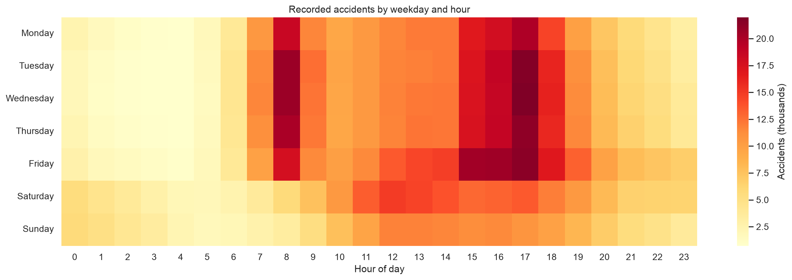

### Road class and severity composition

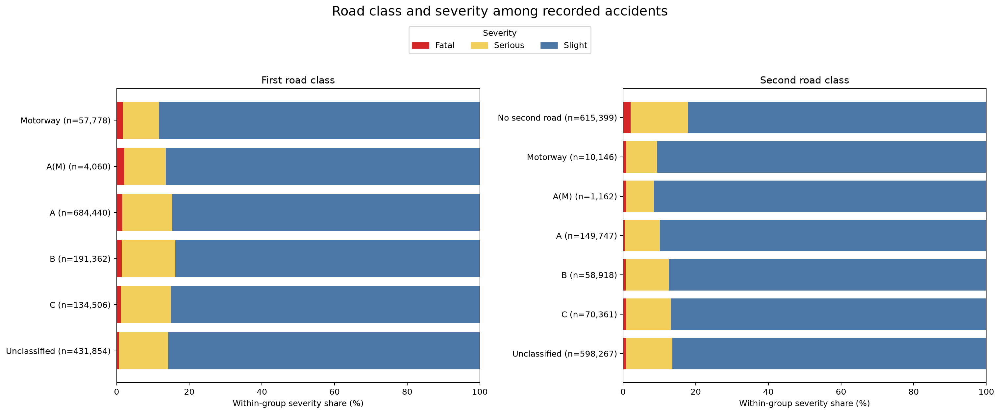

### Environmental conditions and severity composition

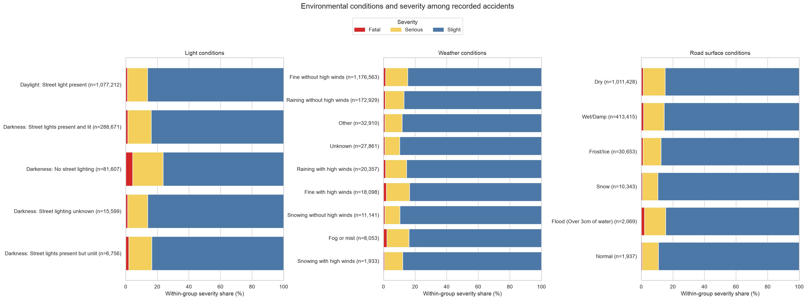

### Pedestrian-crossing facilities and severity composition

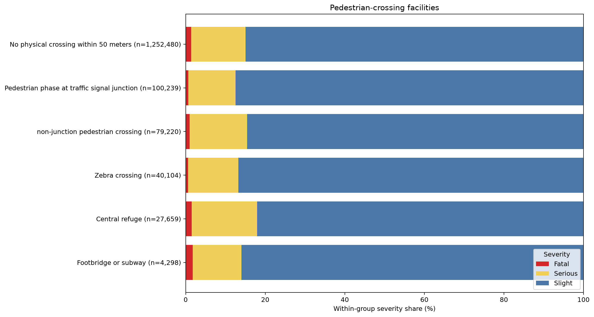

### Spearman correlation matrix

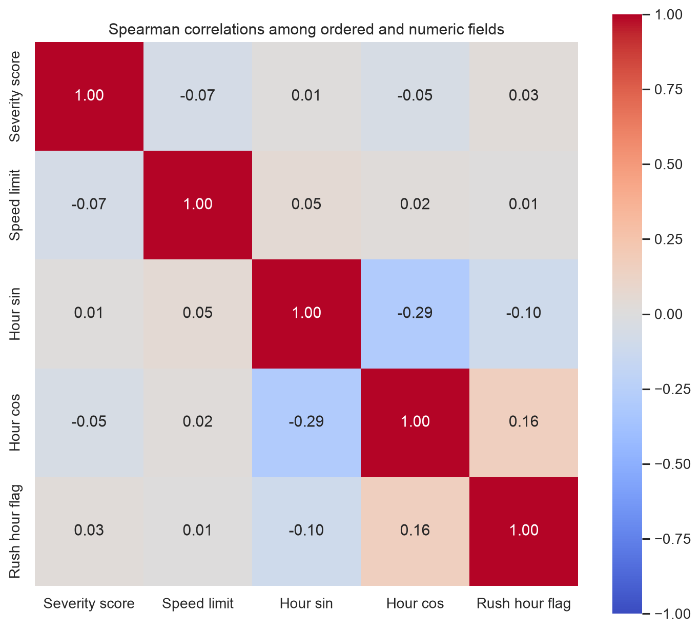

### Categorical association matrix

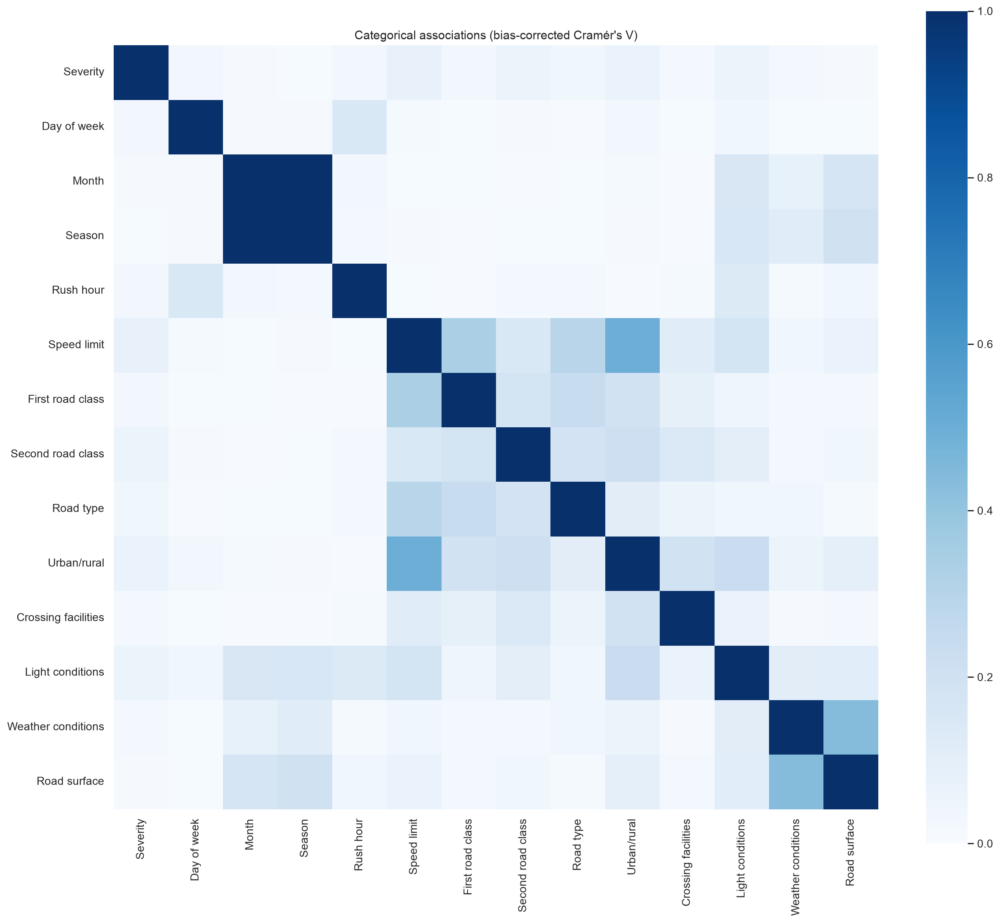

## Appendix E — Additional model diagnostics

### Raw confusion matrix — downsampled baseline

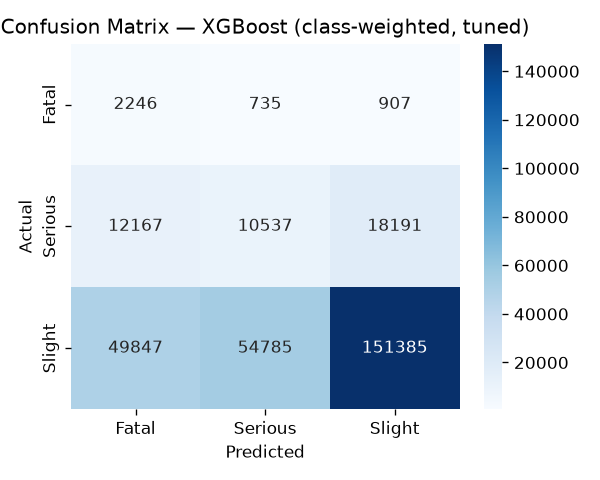

### Global SHAP importance — downsampled baseline

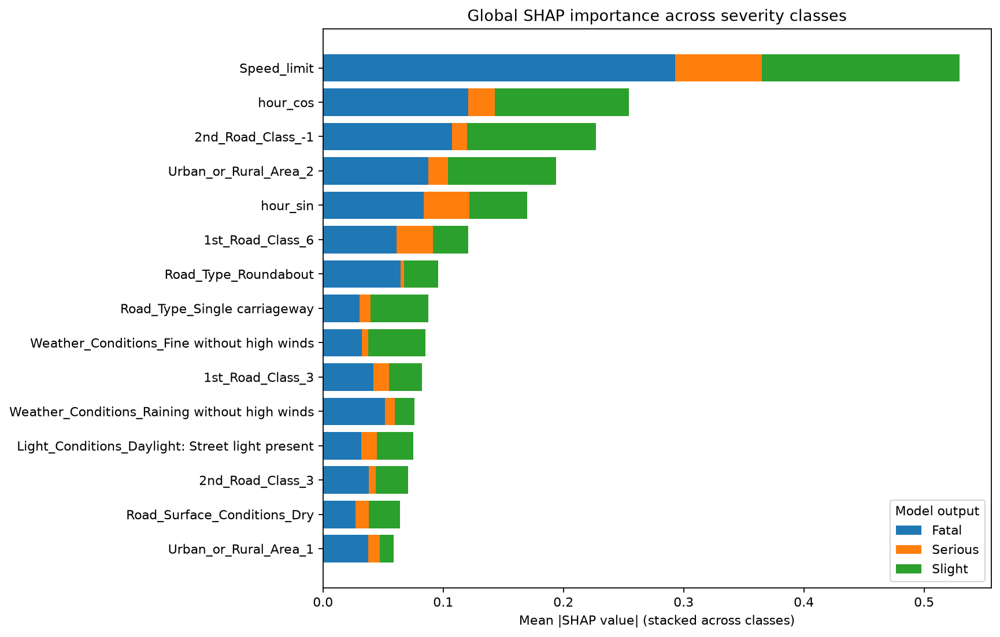

## Appendix F — Full cross-validation results

| Model | Fold | Macro F1 | Accuracy | Fatal F1 | Serious F1 | Slight F1 |
| --- | ---: | ---: | ---: | ---: | ---: | ---: |
| Fixed class-weighted | 1 | 0.3189 | 0.5403 | 0.0635 | 0.1843 | 0.7087 |
| Fixed class-weighted | 2 | 0.3181 | 0.5385 | 0.0625 | 0.1847 | 0.7071 |
| Fixed class-weighted | 3 | 0.3191 | 0.5412 | 0.0644 | 0.1832 | 0.7098 |
| Fixed class-weighted | 4 | 0.3220 | 0.5449 | 0.0655 | 0.1880 | 0.7126 |
| Fixed class-weighted | 5 | 0.3205 | 0.5409 | 0.0639 | 0.1892 | 0.7085 |
| Tuned class-weighted | 1 | 0.3241 | 0.5442 | 0.0663 | 0.1980 | 0.7080 |
| Tuned class-weighted | 2 | 0.3231 | 0.5443 | 0.0653 | 0.1957 | 0.7084 |
| Tuned class-weighted | 3 | 0.3252 | 0.5483 | 0.0672 | 0.1963 | 0.7121 |
| Tuned class-weighted | 4 | 0.3264 | 0.5479 | 0.0668 | 0.2013 | 0.7111 |
| Tuned class-weighted | 5 | 0.3261 | 0.5475 | 0.0664 | 0.2016 | 0.7103 |
| Ordinal cumulative | 1 | 0.2997 | 0.6561 | 0.0618 | 0.0231 | 0.8141 |
| Ordinal cumulative | 2 | 0.2995 | 0.6582 | 0.0606 | 0.0222 | 0.8156 |
| Ordinal cumulative | 3 | 0.3001 | 0.6562 | 0.0617 | 0.0246 | 0.8141 |
| Ordinal cumulative | 4 | 0.2997 | 0.6578 | 0.0615 | 0.0223 | 0.8152 |
| Ordinal cumulative | 5 | 0.2996 | 0.6554 | 0.0614 | 0.0240 | 0.8132 |
| Interpolated weights | 1 | 0.3418 | 0.6536 | 0.0704 | 0.1522 | 0.8030 |
| Interpolated weights | 2 | 0.3421 | 0.6539 | 0.0694 | 0.1540 | 0.8028 |
| Interpolated weights | 3 | 0.3432 | 0.6566 | 0.0705 | 0.1546 | 0.8045 |
| Joint tuned | 1 | 0.3373 | 0.7753 | 0.0836 | 0.0452 | 0.8831 |
| Joint tuned | 2 | 0.3378 | 0.7756 | 0.0819 | 0.0482 | 0.8834 |
| Joint tuned | 3 | 0.3381 | 0.7748 | 0.0833 | 0.0481 | 0.8831 |
| Joint tuned | 4 | 0.3381 | 0.7774 | 0.0856 | 0.0442 | 0.8846 |
| Joint tuned | 5 | 0.3374 | 0.7757 | 0.0828 | 0.0457 | 0.8836 |
| Downsampled baseline | 1 | 0.3380 | 0.5991 | 0.0204 | 0.2643 | 0.7294 |
| Downsampled baseline | 2 | 0.3339 | 0.5874 | 0.0200 | 0.2632 | 0.7186 |
| Downsampled baseline | 3 | 0.3359 | 0.5909 | 0.0215 | 0.2641 | 0.7219 |
| Downsampled baseline | 4 | 0.3421 | 0.6038 | 0.0257 | 0.2673 | 0.7335 |
| Downsampled baseline | 5 | 0.3366 | 0.5878 | 0.0281 | 0.2626 | 0.7190 |

Full-precision fold metrics are available in [`cv_results.csv`](results/cv_results.csv).
