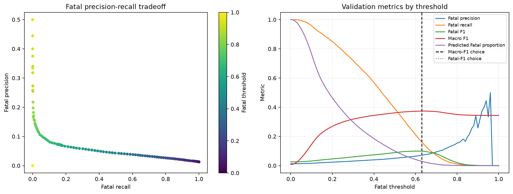

# Tuned weighted XGBoost Fatal-threshold results

The threshold was selected exclusively from five-fold out-of-fold probabilities on the training split. The saved tuned XGBoost model was not changed.

## Selected validation thresholds

| Selection | Threshold | Macro F1 | Fatal precision | Fatal recall | Fatal F1 | Predicted Fatal |
| --- | ---: | ---: | ---: | ---: | ---: | ---: |
| Maximum macro F1 | 0.6305 | 0.3739 | 0.0719 | 0.1633 | 0.0998 | 2.94% |
| Maximum Fatal F1 | 0.6290 | 0.3739 | 0.0716 | 0.1655 | 0.0999 | 2.99% |

## Validation threshold summary

| Threshold | Macro F1 | Fatal precision | Fatal recall | Fatal F1 | Predicted Fatal |
| ---: | ---: | ---: | ---: | ---: | ---: |
| 0.0500 | 0.0523 | 0.0137 | 0.9934 | 0.0270 | 93.65% |
| 0.1000 | 0.1458 | 0.0162 | 0.9590 | 0.0319 | 76.48% |
| 0.2000 | 0.2693 | 0.0237 | 0.8491 | 0.0460 | 46.38% |
| 0.3000 | 0.3187 | 0.0313 | 0.7193 | 0.0599 | 29.74% |
| 0.4000 | 0.3440 | 0.0397 | 0.5683 | 0.0742 | 18.51% |
| 0.5000 | 0.3618 | 0.0504 | 0.3911 | 0.0893 | 10.03% |
| 0.6290 | 0.3739 | 0.0716 | 0.1655 | 0.0999 | 2.99% |
| 0.6305 | 0.3739 | 0.0719 | 0.1633 | 0.0998 | 2.94% |
| 0.7500 | 0.3598 | 0.1198 | 0.0306 | 0.0488 | 0.33% |

## Final untouched-test comparison

| Model | Macro F1 | Accuracy | Fatal precision | Fatal recall | Fatal F1 |
| --- | ---: | ---: | ---: | ---: | ---: |
| XGBoost baseline (validated) | 0.363 | 0.606 | 0.088 | 0.050 | 0.064 |
| XGBoost (class-weighted, validated) | 0.335 | 0.545 | 0.035 | 0.642 | 0.067 |
| XGBoost (class-weighted, tuned) | 0.339 | 0.551 | 0.037 | 0.614 | 0.069 |
| XGBoost (class-weighted, tuned + Fatal threshold) | 0.375 | 0.603 | 0.074 | 0.170 | 0.103 |

Classes: 0=Fatal, 1=Serious, 2=Slight.
